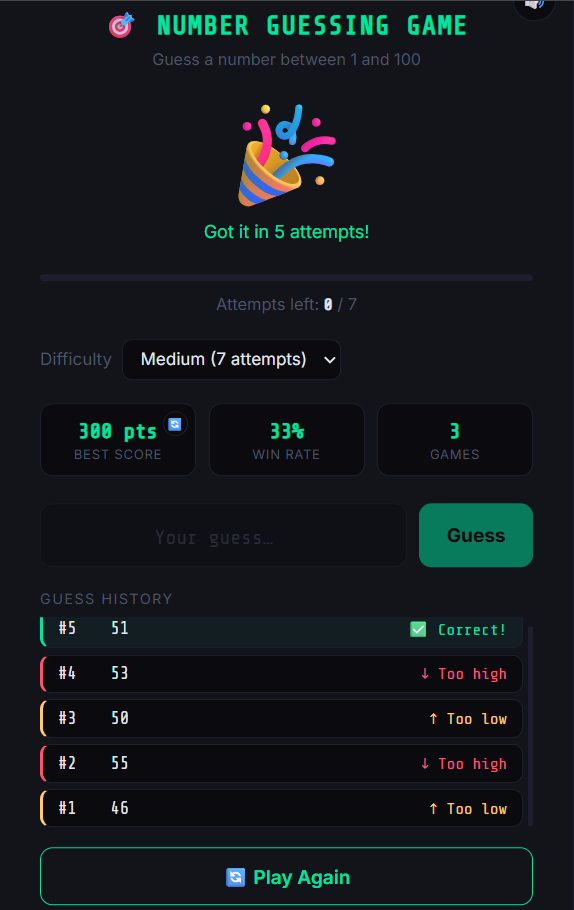

# 🎯 Number Guessing Game


A sleek, dark-themed, browser-based Number Guessing Game with difficulty levels, sound effects, live stats, and a fully responsive UI.

**🔗 Live Demo:** [zihanur-rahman.github.io/Number-Guessing-Game](https://zihanur-rahman.github.io/Number-Guessing-Game/)



## ✨ Features

- 🎚️ **Three difficulty levels** — Hard (5 attempts), Medium (7), Easy (10)
- 🔊 **Sound effects** — built with the Web Audio API, no external audio files
- 📊 **Live stats** — best score, win rate, and total games played (persisted via `localStorage`)
- 📱 **Fully responsive** — optimized layout for mobile and desktop
- ✨ **Micro-interactions** — smooth animations, hover effects, and input feedback
- 🎨 **Dark UI** — clean, modern, distraction-free design

## 🛠️ Built With

- HTML5
- CSS3 (custom properties, Grid, Flexbox, media queries)
- Vanilla JavaScript (no frameworks or dependencies)
- Web Audio API for in-browser sound generation

## 🚀 Getting Started

No build step or dependencies required.

```bash
git clone https://github.com/zihanur-rahman/Number-Guessing-Game.git
cd Number-Guessing-Game
```

Just open `index.html` in your browser, or visit the [live demo](https://zihanur-rahman.github.io/Number-Guessing-Game/).

## 📄 License

This project is open source. Feel free to fork and modify.

---

**Author:** [Zihanur Rahman](https://github.com/zihanur-rahman)
